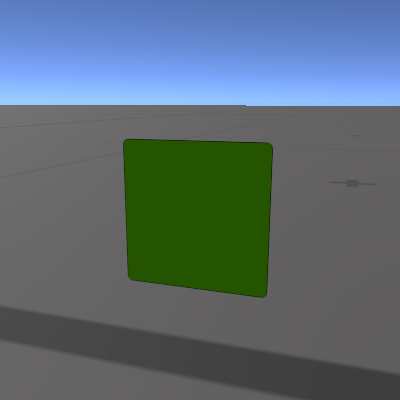
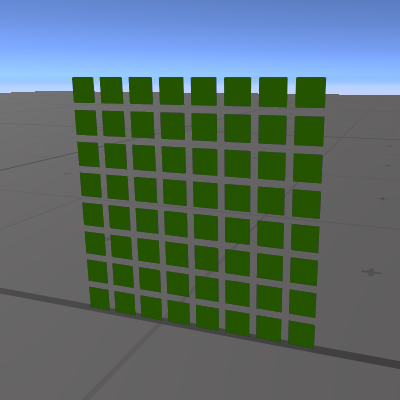
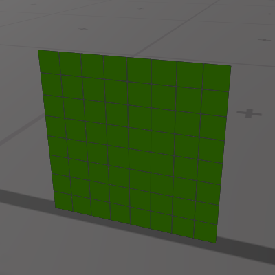
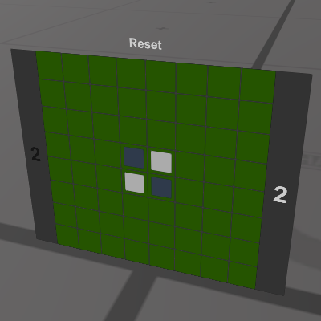

## VRChat ワールドギミック リバーシを作ろう
[この記事を書いている人のBooth](https://ebicochineal.booth.pm/)







## 手動リバーシ
- 同期はするけど裏返すのは手動で、というリバーシを考えてみましょう。
- グローバルスイッチのような物を8*8敷き詰めたら出来そう。
- ただしオンオフではなく「なし」、「白」、「黒」と切り替える。
- 状態が「なし」、「白」、「黒」の３つなので真と偽の2つの状態のBool型ではなく数値型を使う。
- 数値型のInt型は4byteなのでサイズが大きく同期する時の通信に無駄が発生するので避けたい。なのでByte型を使う。

これでとりあえず二人で遊べそうです。  

- Cell [Canvas]、[GraphicRaycaster]、[VRC UIShape]、[SingleCell (Script)]
  - Panel [Image] 緑色の背景Panel
  - White [Image] Backgroundより少し小さくする
  - Black [Image] Backgroundより少し小さくする
  - Button [Button] 色が透明のボタン　SingleCellスクリプトを指定しSendCustomEventでUseメソッドを指定
  
このようなものを作り縦横8個ずつ並べると良いでしょう。  

[ReversiSingleCell.unitypackage](https://github.com/ebi-cp/docs/blob/master/ebi-programming-magazine/23/ReversiSingleCell.unitypackage)  
```cs
using UdonSharp;
using UnityEngine;
using VRC.SDKBase;
using VRC.Udon;

using VRC.Udon.Common.Interfaces;

namespace UdonExample {
    [UdonBehaviourSyncMode(BehaviourSyncMode.Manual)]
    public class SingleCell : UdonSharpBehaviour {
        public GameObject black;
        public GameObject white;
        public byte cellState = 0;// None, Black, White
        [UdonSynced(UdonSyncMode.None)]
        byte cellStateSync = 0;
        
        void Start () {
            // 初期値をもとに描画
            this.DrawCell();
        }
        
        public void Use () {
            this.SendCustomNetworkEvent(NetworkEventTarget.Owner, "OwnerSync");
        }
        
        public void OwnerSync () {
            this.cellState = (byte)((this.cellState+1) % 3);
            this.cellStateSync = this.cellState;
            this.RequestSerialization();
            this.DrawCell();
        }
        
        public override void OnDeserialization () {
            this.cellState = this.cellStateSync;
            this.DrawCell();
        }
        
        void DrawCell () {
            // どちらかがnullなら何もしない
            if (this.black == null || this.white == null) { return; }
            
            this.black.SetActive(this.cellState == 1);
            this.white.SetActive(this.cellState == 2);
        }
    }
}
```
このスクリプトはグローバルスイッチを少しいじった程度の物なので理解できるかと思います。  
６４つ全てのマスを１つのスクリプトで管理したいので次は配列を使い実装します。  

#### 配列を使いスクリプトを1つにまとめる
- 1つだけ難しい問題があります。というより少しだけ面倒です。上ではボタンのSendCustomEventでUseメソッドを指定しましたが、64つのボタンが1つのスクリプトに対しUseメソッドを呼んでも、どのボタンが押されたのか知る事が出来ません。なのでスクリプト側でメソッドを６４つ用意しそれぞれのボタンがボタン１ならメソッド１を呼ぶなどする必要があります。
- 同期方法も変更します。今までの同期方法はオーナーでないプレイヤーがボタンを押すとオーナーに同期してもらうよう頼んでいましたが、オーナーでない場合自分がオーナーになり自分で同期するように変更します。
- なぜ同期方法を変更するのか、ボタンからSendCustomEventで引数が使えないので64つ必要になり、さらにオーナーに送るSendCustomNetworkEventでも引数が使えないので64つ必要になり必要なメソッドが増えてしまいます。それを避けるために同期方法を変更します。

#### 同期はこのようになります
```cs
void Use1 () {// オーナー、非オーナー、ボタンの数だけ必要
    this.SendCustomNetworkEvent(NetworkEventTarget.Owner, "NetworkEventUse1");
}
void NetworkEventUse1 () {// オーナー、ボタンの数だけ必要
    this.OwnerSync(1);
}
public void OwnerSync (int n) {// オーナー
    // 同期変数の更新
    this.RequestSerialization();
    ...
}

↓

void Use1 () {// オーナー、非オーナー、ボタンの数だけ必要
    this.ForcedSync(1);
}
void ForcedSync (int n) {// オーナー、非オーナー
    // 非オーナーの場合、自分がオーナーになります
    if (!Networking.IsOwner(Networking.LocalPlayer, this.gameObject)) {
        Networking.SetOwner(Networking.LocalPlayer, this.gameObject);
    }
    // 同期変数の更新
    this.RequestSerialization();
    ...
}

```
- この同期方法スクリプトがシンプルになり、操作した本人はラグが全く無いというメリットがあります。前回の方法でも変数の同期を待たずに見た目の更新などすればラグを感じないように出来なくも無いです。
- この同期方法はデメリットもあります。それがオーナー分裂問題です。SetOwnerを同時にしてしまうと互いにオーナーになり同期できなくなります。
- リバーシは交互にボタンを押すことになります。意図的に同期ずれを引き起こさなければ同期ずれは起きにくいものと思われます。
- 同期できなくなるのはボタンを操作していたプレイヤーのみです。第三者がゲームでオーナーになった途端同期ずれは解消されます。同期ずれを意図的に引き起こすためプレイヤーAさんとBさんがいたとして、その二人で同期ずれを引き起こしたとしても他のプレイヤーCさんとDさんが対戦しようとボタンを押した段階でオーナーが移るので正常に同期できます。
 
#### スクリプト全体の流れ
- ボタンが押されるとオーナーでないならオーナになります。
- 変数をコピーし同期をリクエストします。
- 同期された変数をもとに石の表示を更新します。

[ReversiManual.unitypackage](https://github.com/ebi-cp/docs/blob/master/ebi-programming-magazine/23/ReversiManual.unitypackage)  
```cs
using UdonSharp;
using UnityEngine;
using VRC.SDKBase;
using VRC.Udon;

namespace UdonExample {
    [UdonBehaviourSyncMode(BehaviourSyncMode.Manual)]
    public class ReversiManualGameManager : UdonSharpBehaviour {
        public Transform stones;
        byte[] board = new byte[64];// 0 None, 1 Black, 2 White
        [UdonSynced(UdonSyncMode.None)] byte[] boardSync = new byte[64];
        
        void Start () {
            this.board[27] = 1;
            this.board[28] = 2;
            this.board[35] = 2;
            this.board[36] = 1;
            this.UpdateBoard();
        }
        
        public void ForcedSync (int n) {
            if (!Networking.IsOwner(Networking.LocalPlayer, this.gameObject)) {
                Networking.SetOwner(Networking.LocalPlayer, this.gameObject);
            }
            this.board[n] = (byte)((this.board[n] + 1) % 3);
            for (int i = 0; i < this.board.Length; ++i) { this.boardSync[i] = this.board[i]; }
            
            this.RequestSerialization();
            this.UpdateBoard();
        }
        
        public override void OnDeserialization () {
            for (int i = 0; i < this.board.Length; ++i) { this.board[i] = this.boardSync[i]; }
            this.UpdateBoard();
        }
        
        void UpdateBoard () {
            if (this.stones == null) { return; }
            for (int i = 0; i < this.stones.childCount; ++i) {
                Transform black = this.stones.GetChild(i).GetChild(0);
                Transform white = this.stones.GetChild(i).GetChild(1);
                if (this.board[i] == 1) {
                    black.gameObject.SetActive(true);
                    white.gameObject.SetActive(false);
                } else if (this.board[i] == 2) {
                    white.gameObject.SetActive(true);
                    black.gameObject.SetActive(false);
                } else {
                    black.gameObject.SetActive(false);
                    white.gameObject.SetActive(false);
                }
            }
        }
        
        // uGUIのボタンからSendCustomEventで呼び出すメソッド
        public void Use0 () { this.ForcedSync(0); }
        public void Use1 () { this.ForcedSync(1); }
        public void Use2 () { this.ForcedSync(2); }
        public void Use3 () { this.ForcedSync(3); }
        public void Use4 () { this.ForcedSync(4); }
        public void Use5 () { this.ForcedSync(5); }
        public void Use6 () { this.ForcedSync(6); }
        public void Use7 () { this.ForcedSync(7); }
        public void Use8 () { this.ForcedSync(8); }
        public void Use9 () { this.ForcedSync(9); }
        
        public void Use10 () { this.ForcedSync(10); }
        public void Use11 () { this.ForcedSync(11); }
        public void Use12 () { this.ForcedSync(12); }
        public void Use13 () { this.ForcedSync(13); }
        public void Use14 () { this.ForcedSync(14); }
        public void Use15 () { this.ForcedSync(15); }
        public void Use16 () { this.ForcedSync(16); }
        public void Use17 () { this.ForcedSync(17); }
        public void Use18 () { this.ForcedSync(18); }
        public void Use19 () { this.ForcedSync(19); }
        
        public void Use20 () { this.ForcedSync(20); }
        public void Use21 () { this.ForcedSync(21); }
        public void Use22 () { this.ForcedSync(22); }
        public void Use23 () { this.ForcedSync(23); }
        public void Use24 () { this.ForcedSync(24); }
        public void Use25 () { this.ForcedSync(25); }
        public void Use26 () { this.ForcedSync(26); }
        public void Use27 () { this.ForcedSync(27); }
        public void Use28 () { this.ForcedSync(28); }
        public void Use29 () { this.ForcedSync(29); }
        
        public void Use30 () { this.ForcedSync(30); }
        public void Use31 () { this.ForcedSync(31); }
        public void Use32 () { this.ForcedSync(32); }
        public void Use33 () { this.ForcedSync(33); }
        public void Use34 () { this.ForcedSync(34); }
        public void Use35 () { this.ForcedSync(35); }
        public void Use36 () { this.ForcedSync(36); }
        public void Use37 () { this.ForcedSync(37); }
        public void Use38 () { this.ForcedSync(38); }
        public void Use39 () { this.ForcedSync(39); }
        
        public void Use40 () { this.ForcedSync(40); }
        public void Use41 () { this.ForcedSync(41); }
        public void Use42 () { this.ForcedSync(42); }
        public void Use43 () { this.ForcedSync(43); }
        public void Use44 () { this.ForcedSync(44); }
        public void Use45 () { this.ForcedSync(45); }
        public void Use46 () { this.ForcedSync(46); }
        public void Use47 () { this.ForcedSync(47); }
        public void Use48 () { this.ForcedSync(48); }
        public void Use49 () { this.ForcedSync(49); }
        
        public void Use50 () { this.ForcedSync(50); }
        public void Use51 () { this.ForcedSync(51); }
        public void Use52 () { this.ForcedSync(52); }
        public void Use53 () { this.ForcedSync(53); }
        public void Use54 () { this.ForcedSync(54); }
        public void Use55 () { this.ForcedSync(55); }
        public void Use56 () { this.ForcedSync(56); }
        public void Use57 () { this.ForcedSync(57); }
        public void Use58 () { this.ForcedSync(58); }
        public void Use59 () { this.ForcedSync(59); }
        
        public void Use60 () { this.ForcedSync(60); }
        public void Use61 () { this.ForcedSync(61); }
        public void Use62 () { this.ForcedSync(62); }
        public void Use63 () { this.ForcedSync(63); }
    }
}
```

どのようにすれば盤面全体を1つのスクリプトで同期できるかが分かりました。  
次は完璧なリバーシを目指します。  

## 同期し、自動で裏返し、数え上げてくれるリバーシ
#### 追加しなければならない機能
- 現在黒か白かを表す同期変数
- 有効手かのチェック
- 挟むと裏返す処理
- 石を数える
- リセット

座標と方向を引数に何枚裏返すことができるかを返すメソッドを実装すれば、有効かどうかのチェックと裏返し処理で使いまわすことができます。  

#### uGUI
- Canvas
  - Background [Image]
  - Stones
    - Stone
      - Black [Image]
      - White [Image]
    - ...
  - Buttons
    - Button [Button]
      - Black [Image]
      - White [Image]
    - ...
  - BlackCnt [Text]
  - WhiteCnt [Text]
  - Reset [button]


#### スクリプト全体の流れ
- ボタンが押されるとオーナーでないならオーナになります。
- 石を置き、裏返します。
- 変数をコピーし同期をリクエストします。
- 同期された変数をもとに石の表示を更新と、カウント用のテキストの更新、次置くことができる位置のボタンのみ有効にします。

[Reversi.unitypackage](https://github.com/ebi-cp/docs/blob/master/ebi-programming-magazine/23/Reversi.unitypackage)  
```cs
using UdonSharp;
using UnityEngine;
using VRC.SDKBase;
using VRC.Udon;
using UnityEngine.UI;

namespace UdonExample {
    [UdonBehaviourSyncMode(BehaviourSyncMode.Manual)]
    public class ReversiGameManager : UdonSharpBehaviour {
        public Transform stones;
        public Transform buttons;
        public Text blackCnt;
        public Text whiteCnt;
        int[] xdir = new int[8] {-1,  0,  1, -1,  1, -1,  0,  1};
        int[] ydir = new int[8] {-1, -1, -1,  0,  0,  1,  1,  1};
        int boardSize = 8;
        
        byte color = 1;// 1 black, 2 white
        [UdonSynced(UdonSyncMode.None)] byte colorSync = 1;
        byte[] board = new byte[64];// 0 None, 1 Black, 2 White
        [UdonSynced(UdonSyncMode.None)] byte[] boardSync = new byte[64];
        
        void Start () {
            this.Reset();
            this.UpdateBoard();
        }
        
        void Reset () {
            this.color = 1;
            for (int i = 0; i < this.board.Length; ++i) { this.board[i] = 0; }
            this.board[27] = 1;
            this.board[28] = 2;
            this.board[35] = 2;
            this.board[36] = 1;
        }
        
        // ある場所に置くと指定した方向にいくつ裏返すことができるかを返します。
        int ReverseCount (int px, int py, int dx, int dy) {
            int cnt = 0;
            while (true) {
                px += dx;
                py += dy;
                // 範囲外なら無効としcntを0にしてループを抜ける
                if (px < 0 || px >= this.boardSize || py < 0 || py >= this.boardSize) { cnt = 0; break; }
                // 空なら無効としcntを0にしてループを抜ける
                if (this.board[py*this.boardSize+px] == 0) { cnt = 0; break; }
                // 黒番で黒ならカウントは有効としループを抜ける
                if (this.color == 1 && this.board[py*this.boardSize+px] == 1) { break; }
                // 白番で白ならカウントは有効としループを抜ける
                if (this.color == 2 && this.board[py*this.boardSize+px] == 2) { break; }
                cnt += 1;
            }
            return cnt;
        }
        
        // 石を置くことが出Ð切るかどうかを返します
        bool IsValid (int n) {
            int px = n % this.boardSize;
            int py = n / this.boardSize;
            if (this.board[n] > 0) { return false; }
            for (int i = 0; i < 8; ++i) {
                if (this.ReverseCount(px, py, this.xdir[i], this.ydir[i]) > 0) { return true; }
            }
            return false;
        }
        
        // 石を置き石を裏返します
        void ReverseStone (int n) {
            this.board[n] = this.color;
            for (int i = 0; i < 8; ++i) {
                int px = n % this.boardSize;
                int py = n / this.boardSize;
                int c = this.ReverseCount(px, py, this.xdir[i], this.ydir[i]);
                for (int j = 0; j < c; ++j) {
                    px += this.xdir[i];
                    py += this.ydir[i];
                    this.board[py*this.boardSize+px] = this.color;
                }
            }
        }
        
        // 現在のターンの色を黒白入れ替えます
        void ChangeColor () {
            this.color = (byte)(this.color == 1 ? 2 : 1);
        }
        
        // 石を置き同期します、またリセットはn=100です
        public void ForcedSync (int n) {
            if (!Networking.IsOwner(Networking.LocalPlayer, this.gameObject)) {
                Networking.SetOwner(Networking.LocalPlayer, this.gameObject);
            }
            
            if (n == 100) {
                this.Reset();
            } else {
                this.ReverseStone(n);
                this.ChangeColor();
            }
            
            this.colorSync = this.color;
            for (int i = 0; i < this.board.Length; ++i) { this.boardSync[i] = this.board[i]; }
            
            this.RequestSerialization();
            this.UpdateBoard();
        }
        
        public override void OnDeserialization () {
            this.color = this.colorSync;
            for (int i = 0; i < this.board.Length; ++i) { this.board[i] = this.boardSync[i]; }
            this.UpdateBoard();
        }
        
        // 置くことができる場所ならドットを表示しボタンを有効化します。また置くことができる場所の数も返します
        int UpdateButton () {
            int cnt = 0;
            for (int i = 0; i < this.board.Length; ++i) {
                bool valid = this.IsValid(i);
                if (valid) { cnt += 1; };
                this.buttons.GetChild(i).gameObject.SetActive(valid);
                if (this.color == 1) {
                    this.buttons.GetChild(i).GetChild(0).gameObject.SetActive(true);
                    this.buttons.GetChild(i).GetChild(1).gameObject.SetActive(false);
                }
                if (this.color == 2){
                    this.buttons.GetChild(i).GetChild(0).gameObject.SetActive(false);
                    this.buttons.GetChild(i).GetChild(1).gameObject.SetActive(true);
                }
            }
            return cnt;
        }
        
        // それぞれの石の数を数えテキストを更新します
        void UpdateText () {
            int b = 0;
            int w = 0;
            for (int i = 0; i < this.board.Length; ++i) {
                if (this.board[i] == 1) { b += 1; }
                if (this.board[i] == 2) { w += 1; }
            }
            this.blackCnt.text = b.ToString();
            this.whiteCnt.text = w.ToString();
        }
        
        // ボード全体を更新します
        void UpdateBoard () {
            if (this.stones == null) { return; }
            if (this.buttons == null) { return; }
            for (int i = 0; i < this.board.Length; ++i) {
                Transform black = this.stones.GetChild(i).GetChild(0);
                Transform white = this.stones.GetChild(i).GetChild(1);
                if (this.board[i] == 1) {
                    black.gameObject.SetActive(true);
                    white.gameObject.SetActive(false);
                } else if (this.board[i] == 2) {
                    white.gameObject.SetActive(true);
                    black.gameObject.SetActive(false);
                } else {
                    black.gameObject.SetActive(false);
                    white.gameObject.SetActive(false);
                }
            }
            this.UpdateText();
            int cnt = this.UpdateButton();
            if (cnt > 0) { return; }// 石が打てる場所がある場合ここでreturn
            this.ChangeColor();// パスなので黒白の反転
            this.UpdateButton();
        }
        
        public void Use0 () { this.ForcedSync(0); }
        public void Use1 () { this.ForcedSync(1); }
        public void Use2 () { this.ForcedSync(2); }
        public void Use3 () { this.ForcedSync(3); }
        public void Use4 () { this.ForcedSync(4); }
        public void Use5 () { this.ForcedSync(5); }
        public void Use6 () { this.ForcedSync(6); }
        public void Use7 () { this.ForcedSync(7); }
        public void Use8 () { this.ForcedSync(8); }
        public void Use9 () { this.ForcedSync(9); }
        
        public void Use10 () { this.ForcedSync(10); }
        public void Use11 () { this.ForcedSync(11); }
        public void Use12 () { this.ForcedSync(12); }
        public void Use13 () { this.ForcedSync(13); }
        public void Use14 () { this.ForcedSync(14); }
        public void Use15 () { this.ForcedSync(15); }
        public void Use16 () { this.ForcedSync(16); }
        public void Use17 () { this.ForcedSync(17); }
        public void Use18 () { this.ForcedSync(18); }
        public void Use19 () { this.ForcedSync(19); }
        
        public void Use20 () { this.ForcedSync(20); }
        public void Use21 () { this.ForcedSync(21); }
        public void Use22 () { this.ForcedSync(22); }
        public void Use23 () { this.ForcedSync(23); }
        public void Use24 () { this.ForcedSync(24); }
        public void Use25 () { this.ForcedSync(25); }
        public void Use26 () { this.ForcedSync(26); }
        public void Use27 () { this.ForcedSync(27); }
        public void Use28 () { this.ForcedSync(28); }
        public void Use29 () { this.ForcedSync(29); }
        
        public void Use30 () { this.ForcedSync(30); }
        public void Use31 () { this.ForcedSync(31); }
        public void Use32 () { this.ForcedSync(32); }
        public void Use33 () { this.ForcedSync(33); }
        public void Use34 () { this.ForcedSync(34); }
        public void Use35 () { this.ForcedSync(35); }
        public void Use36 () { this.ForcedSync(36); }
        public void Use37 () { this.ForcedSync(37); }
        public void Use38 () { this.ForcedSync(38); }
        public void Use39 () { this.ForcedSync(39); }
        
        public void Use40 () { this.ForcedSync(40); }
        public void Use41 () { this.ForcedSync(41); }
        public void Use42 () { this.ForcedSync(42); }
        public void Use43 () { this.ForcedSync(43); }
        public void Use44 () { this.ForcedSync(44); }
        public void Use45 () { this.ForcedSync(45); }
        public void Use46 () { this.ForcedSync(46); }
        public void Use47 () { this.ForcedSync(47); }
        public void Use48 () { this.ForcedSync(48); }
        public void Use49 () { this.ForcedSync(49); }
        
        public void Use50 () { this.ForcedSync(50); }
        public void Use51 () { this.ForcedSync(51); }
        public void Use52 () { this.ForcedSync(52); }
        public void Use53 () { this.ForcedSync(53); }
        public void Use54 () { this.ForcedSync(54); }
        public void Use55 () { this.ForcedSync(55); }
        public void Use56 () { this.ForcedSync(56); }
        public void Use57 () { this.ForcedSync(57); }
        public void Use58 () { this.ForcedSync(58); }
        public void Use59 () { this.ForcedSync(59); }
        
        public void Use60 () { this.ForcedSync(60); }
        public void Use61 () { this.ForcedSync(61); }
        public void Use62 () { this.ForcedSync(62); }
        public void Use63 () { this.ForcedSync(63); }
        
        // リセットボタンに設定するメソッドです
        public void UseReset () { this.ForcedSync(100); }
    }
}
```

----


#### 実装難易度について
- 同期関係抜きのリバーシは競技プログラミングAtCoderのビギナーコンテストのB問題ほどの難易度だと思います。理解できる場合、今日から競技プログラマーとしても生きていくことができます。
- [AtCoderのはじめかた - AtCoderInfo](https://info.atcoder.jp/overview/contest/intro)
- [AtCoder Problems](https://kenkoooo.com/atcoder/#/table/)
- [AtCoder Problemsってなに？](https://info.atcoder.jp/more/contents/problems)
- 同期関係が理解できない、裏返せるか調べたりが難しい、uGUIの設定が難しいなど色々あるかと思います。戻ったり次の記事が追加されたらそちらを先に見てみると良いかもしれません。この記事もしばらくすると更新され分かりやすくなるかもしれません。


#### 同期ずれを解消するコード
```cs
public override bool OnOwnershipRequest (VRCPlayerApi requestingPlayer, VRCPlayerApi newOwner) { return true; }
```  
これは偶然発見しまだテスト中なのですが、このメソッド実装しtrueを返すだけでおそらくSetOwnerによる同期ずれは起こらなくなります。  
なぜそうなるのかわからず、ローカルでのテストとネットワークを介しての2クライアントのテストしかしていないので使うべきかどうか悩んでいる所です。  

----
- [戻る](https://github.com/ebi-cp/docs/blob/master/ebi-programming-magazine/README.md)  