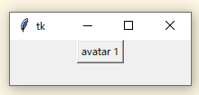
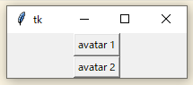

[好きなもの発表会](https://www.notion.so/VRC-2dc0831ec521803ab216d8c3d705ec03)
で発表した内容になります。  


## プログラミング言語 Pythonの紹介


Pythonはシンプルながら様々なことが出来る言語でとても```好きな言語なので```その紹介と解説をしてみようと思います  

PythonはBlenderにも入っていて覚えると自分で拡張機能を作れたりします  
ただBlenderに入っているPythonではファイルの関連付けが行われないので  
プログラムを実行するのが面倒になるので別途インストールすると良いと思います  

---
### 標準出力
```py
print("hello world")
```
print関数です 
かっこの中の文字列や数値を標準出力(黒い画面)に出力します  

プログラミング環境が構築できたかテストするために使われる確認用プログラムです  

---

### 変数と条件式

```py
a = 1
```
aイコール１ではなくプログラミングでは変数aに1を入れるという意味です  
```py
a == 1
```
これはaが1なら真(True)と返す式です  
if文などの条件式に使います  
真(True)、偽(False)はオンとオフみたいなものです  
```py
# シャープの後はコメントと言ってプログラムからは無視されます
a = int(input())# 標準入力から１行読み取り数値として変数aに入れる  
if a == 1:# aが1と等しい(真)なら
    print("式は真です")
    print("1です")
else:# それ以外(偽)なら
    print("式は偽です")
    print("1ではない")
```
if文は条件式で真であればインデントの範囲を実行します  
Pythonではインデントが重要な意味を持ちます  
インデントが強制されるのでPythonを嫌う人もいますが  
```py
a=int(input());print(["式は偽です\n1ではない","式は真です\n1です"][a==1])
```
このように無理矢理１行で書くこともできます  

---
### 条件式とループ文
```py
for i in range(100):
    if i % 3 == 0:
        print(i, "ヽ(゜▽。)ノ")
    else:
        print(i, "(˙-˙)")
```
ループ文の中に条件式であるif文があり
iを３で割った余りが0ならアホの絵文字が出力されるようになっています  
for文はループ文でrangeは0からかっこの中の数値の文だけ数値を作り出す関数となります  
ループごとに変数iの中に０～９９までの１００個の数値が入り１００回ループします  

  

---
### 関数
さきほどprintやrangeといった関数が出てきました  
かっこの中に入れる数値や文字列は引数と言います  
どんな引数を渡せるかは関数ごとに違い引数を必要としない関数も存在します  
関数を順番に呼ぶだけでも簡単なプログラムならできてしまいます  

---
### import文　パッケージ
最低限用意された関数以外はimportしなければ使えません  
import mathとすれば数学関数が使用できます  
また標準的なモジュールしか初期状態では使えず新たに追加するには
黒い画面でpip install パッケージと打ち込みインストールする必要があります

---
### VRChatアバターチェンジプログラム
OSCのコマンドを送ることでVRChatではアバターチェンジやテキストチャットボックスの表示や移動やモーション再生などが行えます  
ここではアバターチェンジプログラムを作ってみます  
```
pip install python-osc
```
黒い画面に打ち込みpython-oscをインストールします  
```py
import pythonosc.udp_client
client = pythonosc.udp_client.SimpleUDPClient("127.0.0.1", 9000)
client.send_message("/avatar/change", "アバターのID")
```
１行目でinportしてモジュールを使用できるようにします  

２行目で通信先（VRChat）を指定して、送信機を作り変数clientに代入します  
毎回住所を書かなくても、client と呼ぶだけで決まった相手にメッセージを送れる状態にしています  

３秒目でclientを使いメッセージを送っていることが分かります  
２つ目の引数は使用するアバターのIDです（所有しているアバターIDに書き換える必要があります）  

上記をメモ帳などで作成しデスクトップにavatar_change.pyとし保存します  
保存したらpyが関連付けされていればダブルクリップすることで実行できます  


---
### GUI化してみる 
  

Tkinterを使いGUI化してみます
```py
import tkinter
import pythonosc.udp_client

def func1():# button1に登録する関数です
    client.send_message("/avatar/change", "アバターのID")
client = pythonosc.udp_client.SimpleUDPClient("127.0.0.1", 9000)
root = tkinter.Tk()# ウィンドウを作ります
root.geometry("200x50")# ウィンドウサイズを指定します
button1 = tkinter.Button(root, text = "avatar 1", command = func1)# ボタンを作成します
button1.pack()# ボタンを配置します
root.mainloop()# メインループです。

```

---
### GUI化してみる ボタンを２つにふやす 
  
```py
import tkinter
import pythonosc.udp_client

def func1():
    client.send_message("/avatar/change", "アバターのID 1")
def func2():
    client.send_message("/avatar/change", "アバターのID 2")

client = pythonosc.udp_client.SimpleUDPClient("127.0.0.1", 9000)
root = tkinter.Tk()
root.geometry("200x50")
button1 = tkinter.Button(root, text = "avatar 1", command = func1)
button1.pack()
button2 = tkinter.Button(root, text = "avatar 2", command = func2)
button2.pack()
root.mainloop()
```
そしてファイルの拡張子を.pyから.pywにすることで黒い画面が出なくなります  
GUIアプリの場合は.pywにすると良いでしょう  

### 最後に
ここまでに学んだ事とリストやクラスを学べばPythonの基礎は学んだ事になります  
あとはやりたい事を検索したりAIに聞けば何でもできるはずです  


[VRChat公式のOSCの記事](https://docs.vrchat.com/docs/osc-as-input-controller)


----
- [戻る](https://github.com/ebi-cp/docs/blob/master/ebi-programming-magazine/README.md)  